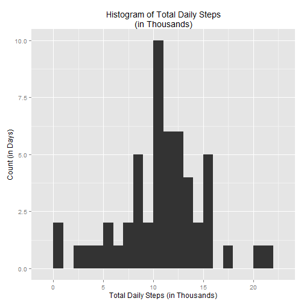
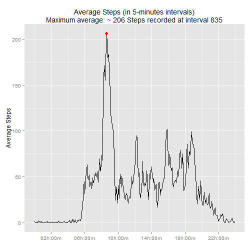
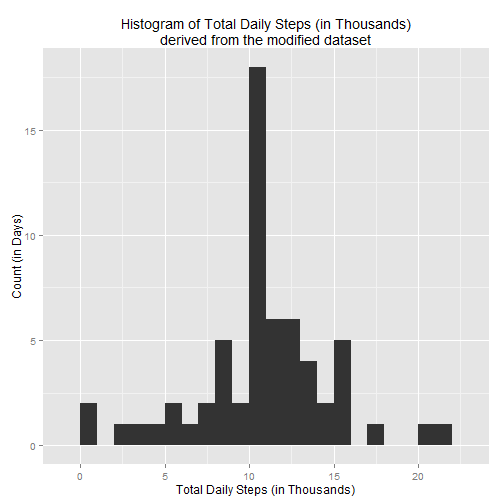
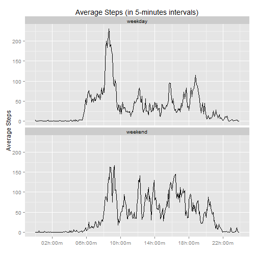

### System and platform documentation

Before any analysis is performed, let's start with system and platform documentation in a fresh directory to insure reproducibility.


```r
Sys.info()[1:5]                         # system info but exclude login and user info
```

```
##                      sysname                      release 
##                    "Windows"                      "7 x64" 
##                      version                     nodename 
## "build 7601, Service Pack 1"                   "STALLION" 
##                      machine 
##                     "x86-64"
```

```r
project<-'PA1'                          # create new project
if (!file.exists(project)){dir.create(project)}           
userdir<-getwd()                        # user-defined startup directory
projectdir<-paste(userdir,project,sep="/")
setwd(projectdir)                       # work from the project directory
datadir<-"./data" ; if (!file.exists("data")) { dir.create("data") } # data will reside in subdir 
library(dplyr)                          # provides data manipulating functions
library(ggplot2)                        # for graphics
library(magrittr)                       # ceci n'est pas une pipe
library(scales)                         # for scaling time series in ggplot
sessionInfo()                           # to document platform
```

```
## R version 3.1.3 (2015-03-09)
## Platform: x86_64-w64-mingw32/x64 (64-bit)
## Running under: Windows 7 x64 (build 7601) Service Pack 1
## 
## locale:
## [1] LC_COLLATE=English_United States.1252 
## [2] LC_CTYPE=English_United States.1252   
## [3] LC_MONETARY=English_United States.1252
## [4] LC_NUMERIC=C                          
## [5] LC_TIME=English_United States.1252    
## 
## attached base packages:
## [1] stats     graphics  grDevices utils     datasets  methods   base     
## 
## other attached packages:
## [1] knitr_1.9     scales_0.2.4  magrittr_1.5  ggplot2_1.0.1 dplyr_0.4.1  
## 
## loaded via a namespace (and not attached):
##  [1] assertthat_0.1   colorspace_1.2-6 DBI_0.3.1        digest_0.6.8    
##  [5] evaluate_0.5.5   formatR_1.1      grid_3.1.3       gtable_0.1.2    
##  [9] htmltools_0.2.6  labeling_0.3     lazyeval_0.1.10  markdown_0.7.4  
## [13] MASS_7.3-40      mime_0.3         munsell_0.4.2    parallel_3.1.3  
## [17] plyr_1.8.1       proto_0.3-10     Rcpp_0.11.5      reshape2_1.4.1  
## [21] rmarkdown_0.5.1  stringr_0.6.2    tools_3.1.3      yaml_2.1.13
```
Notice this markdown was developed on a Windows 64-bit platform with the english US locale. The project resides in the PA1 subdirectory and data will reside in PA/data subdir. We document the libraries used and the session info provides reproducibility on the documented R Studio Platform and the Windows 7 x64 version.

### Loading and pre-processing the data into activity data frame

*It must noted that the download implemented here is using a non-secured link, i.e. with reduced confidence compared to a secured https protocol. However, knittr will encounter an error when attempting to download a binary (.zip) file with an https.protocol. Changing to a non-secured http url and setting file.download="wb" allows knittr to progress. This is strictly observed when knitting and the following error message is generated:*

*Error in download.file(url, dest = filename, mode = "wb") : unsupported URL scheme*

*Note also that R studio can handle https on the same binary file without error.*

The following will populate the data to analyze in the activity data frame, from which the non-missing data subset will be held in the df data frame, to perform a basic description of the data.

```r
url <- "http://d396qusza40orc.cloudfront.net/repdata%2Fdata%2Factivity.zip"
filename <- paste(datadir,strsplit(url,"%2F")[[1]][length(strsplit(url,"%2F")[[1]])],sep="/")
download.file(url, dest=filename, mode="wb")
unzip (filename, exdir = datadir)               # unzip creates and populates the data structure 
unlink(filename)                                # remove the zip file
filename <-(list.files(path=datadir,full.names=T,recursive=T))          # now holds the csv filename
activity <- read.csv(filename,header=TRUE,stringsAsFactors=FALSE)       # populate data frame 
setwd(userdir)                                                          # return work dir to original value
# observe basic information and missing data
str(activity)
```

```
## 'data.frame':	17568 obs. of  3 variables:
##  $ steps   : int  NA NA NA NA NA NA NA NA NA NA ...
##  $ date    : chr  "2012-10-01" "2012-10-01" "2012-10-01" "2012-10-01" ...
##  $ interval: int  0 5 10 15 20 25 30 35 40 45 ...
```

```r
summary(activity)
```

```
##      steps            date              interval     
##  Min.   :  0.00   Length:17568       Min.   :   0.0  
##  1st Qu.:  0.00   Class :character   1st Qu.: 588.8  
##  Median :  0.00   Mode  :character   Median :1177.5  
##  Mean   : 37.38                      Mean   :1177.5  
##  3rd Qu.: 12.00                      3rd Qu.:1766.2  
##  Max.   :806.00                      Max.   :2355.0  
##  NA's   :2304
```

```r
df<-activity[complete.cases(activity),]         # holds the subset of complete cases to analyze
```
Notice that the activity$steps shows 2304 NA's, out of a set of 17568 observations, while date and interval show no missing data. We will immediately apply an as.Date format to the date series and confirm the data type by viewing the 5 first records .

```r
activity$date <- as.Date(activity$date,"%Y-%m-%d")                      # apply date format
head(activity,5)
```

```
##   steps       date interval
## 1    NA 2012-10-01        0
## 2    NA 2012-10-01        5
## 3    NA 2012-10-01       10
## 4    NA 2012-10-01       15
## 5    NA 2012-10-01       20
```

### Q1: What is mean total number of steps taken per day ?

To simplify coding and variables use, we'll implement using the magrittr piping scheme, starting with the df data frame and performing the operators group_by, summarize, and collecting the result in the daily dataframe. We'll retain the summary in the ds vector.


```r
daily <- df %>%                                                                              
         group_by(date) %>%
         summarize(total = sum(steps),average = mean(steps)) %>%
         as.data.frame

(ds<-summary(daily$total, digits=7))
```

```
##     Min.  1st Qu.   Median     Mean  3rd Qu.     Max. 
##    41.00  8841.00 10765.00 10766.19 13294.00 21194.00
```
The daily summary data frame reveals steps taken vary between 41 and 21194, with a Mean value of 10766 and a Median value of 10765. The distribution is represented in the following histogram generated with ggplot and the geom_histogram() syntax. Note we compute the binwidth to generate 30 bins or bars, indeed supressing the warning we would generate if we omitted the binwidth parameter.

```r
g<-ggplot(daily,aes(x=total/1e3))+geom_histogram(binwidth=round(max(daily$total/1e3)/30))+
        labs(title="Histogram of Total Daily Steps\n(in Thousands)")+
        xlab("Total Daily Steps (in Thousands)")+
        ylab("Count (in Days)")
print(g)
```

 

### Q2. What is the average daily activity pattern ?

To answer this question, we summarize the hourly data after grouping per time-sliced intervals of 5-minutes. Again, we'll use the magrittr approach to populate the hourly data frame.

```r
hourly <- df %>%
          group_by(interval) %>%
          summarize(total = sum(steps),average = mean(steps)) %>%
          as.data.frame
```
Next, we'll convert the format of the interval series so it can be used for time series ggplot, which requires a POSIX format. The strategy consists in taking as reference date the 1st date we observed in the data set, df$date[1], and then cast the interval number into a 4 digit character, padded with leading zeros, using the sprintf() function. This allows for unambiguous conversion of a full date in strptime(), once the hour and minues are properly recognized, that is in %H%M format. The last step is to convert the time in POSIXlt format and only display time of day as %H:%M. This is accomplished in as series of magrittr pipes. We'll summarize the hourly dataframe statistics in the dh vector. Note that this chunk contains 2 specific magrittr syntax: 

- Both sprintf() and paste() functions require a parameter passed at a possition which is not the 1st parameter, and thus use the dot(.) placeholder. (see p9 of the magrittr vignette for further details). 
- The use_series is also a series aliases provided by magrittr and is equivalent to the '$' function, which is easier to read when composing chains using the %>% operator. (see p3 of the magrittr vignette for the current list of implemented aliases).

```r
hourly$time <- hourly %>%
        use_series(interval) %>%                # convert interval to POSIXlt for time series plot
        sprintf("%04d",.) %>%                   # format to 4 char long, with leading zeros
        paste(df$date[1],.,sep=" ") %>%         # use df$date[1] at reference date
        strptime("%Y-%m-%d %H%M") %>%
        as.POSIXlt("%H:%M") 

(dh<-summary(hourly$average, digits=7))
```

```
##      Min.   1st Qu.    Median      Mean   3rd Qu.      Max. 
##   0.00000   2.48585  34.11321  37.38260  52.83491 206.16980
```
We can immediately see that the maximum average steps taken is ~206, which we can use to subset the peak dataset, and we'll spot the interval 835. The message msg does answer the question directly:

```r
peak<-hourly[hourly$total==max(hourly$total),]
msg<-paste("Maximum average: ~",round(peak$average),"Steps recorded at interval",peak$interval,sep=" ")
print(msg)
```

```
## [1] "Maximum average: ~ 206 Steps recorded at interval 835"
```
Next we can plot the average step pattern over time, discretized in 5-minutes intervals between 00:00 and 23:55.  
To pinpoint the average maximum value,we overlay the peak value using geom_point(), and also include the message msg as 2nd line of the title. Notice we use the "\n" as newline character.
Note the time axis relies on scale_x_datetime to provide an easy-read x-axis scaled with 4-hour date_breaks, and formatted in customary %H:%M form.

```r
g<-ggplot(hourly,aes(x=time,y=average))+
        geom_line()+
        scale_x_datetime(breaks=date_breaks("4 hour"),labels=date_format("%Hh:%Mm"))+
        geom_point(data=peak,aes(x=time,y=average),color="red",size=3,show_guide=FALSE)+
        labs(title=paste("Average Steps (in 5-minutes intervals)\n",msg,sep=""))+
        xlab("")+
        ylab("Average Steps")
print(g)
```

 

### Q3: Inputing missing values

#### 3.1. Number of NA rows in the dataset

From earlier inspection of the dataset, we noticed 2304 steps series data were missing. We now subset the activity data frame into 2 parts: df.nm holds the non-missing data, and df.m holds the missing records. We can verify the number of df.m rows confirms the number of missing datapoints.

```r
df.nm<-subset(activity,!is.na(activity$steps))
df.m<-subset(activity,is.na(activity$steps))   # retain only the missing activity steps data subset
missing<-nrow(df.m)
msg<-paste("Original dataset includes ",missing," missing data points.",sep="")
print(msg)
```

```
## [1] "Original dataset includes 2304 missing data points."
```

#### 3.2. Replace NAs with 5-min interval mean in activity

We choose to implement a strategy to replace missing data with the average values computed in the same time slice, and use merging to append mean values automatically to the df.m subset. Since both data frames have same interval series, it is the only key necessary to perform the merge. Since we definitely want to retain all data ,we use the option all=T.

```r
df.m<-merge(df.m,hourly[,c(1,3)],all=T)     # merge with hourly
df.m$steps<-df.m$average                    # replace missing steps values with average values
df.m<-df.m[,-(4)]                           # drop average values
```

#### 3.3 Create and populate new dataset df.m

It's only a mattter to recombine all data back together. Again, we merge using the interval key and on all records. We'll finish by arranging the dataset back in order and verify that the number of rows is identical to the original dataset, to confirm nothing was lost.

```r
df.m<-merge(df.m,df.nm,all=T)               # merge back missing and non-missing datasets
df.m<-arrange(df.m,date,interval)           # reorder
identical(nrow(df.m),nrow(activity))
```

```
## [1] TRUE
```

#### 3.4 Make histogram

This step is actually similar to the original histogram, but performed on the modified data frame df.m

```r
daily.m<-df.m %>%                                                                              
         group_by(date) %>%
         summarize(total = sum(steps),average = mean(steps)) %>%
         as.data.frame

(ds.m<-summary(daily.m$total, digits=7))
```

```
##     Min.  1st Qu.   Median     Mean  3rd Qu.     Max. 
##    41.00  9819.00 10766.19 10766.19 12811.00 21194.00
```
We capture the daily modified statistics daily.m in the vector ds.m and plot the new histogram.

```r
g<-ggplot(daily.m,aes(x=total/1e3))+geom_histogram(binwidth=round(max(daily.m$total/1e3)/30))+
        labs(title="Histogram of Total Daily Steps (in Thousands)\nderived from the modified dataset")+
        xlab("Total Daily Steps (in Thousands)")+
        ylab("Count (in Days)")
print(g)
```

 

We can now easily compare daily summaries for the original and modified sets. We bind the two similar vectors together and check for identical daily maximum averages:

```r
(rbind(ds,ds.m))
```

```
##      Min. 1st Qu.   Median     Mean 3rd Qu.  Max.
## ds     41    8841 10765.00 10766.19   13294 21194
## ds.m   41    9819 10766.19 10766.19   12811 21194
```

```r
identical(max(daily$average),max(daily.m$average))
```

```
## [1] TRUE
```
We observe the min, max and mean values are identical, when comparing original and modified datasets.           
We'll do a little more probing comparing the time sliced datasets:

```r
hourly.m <- df.m %>%
            group_by(interval) %>%
            summarize(total = sum(steps),average = mean(steps)) %>%
            as.data.frame  

dh.m<-summary(hourly.m$average, digits=7)
(rbind(dh,dh.m))
```

```
##      Min.  1st Qu.   Median    Mean  3rd Qu.     Max.
## dh      0 2.485849 34.11321 37.3826 52.83491 206.1698
## dh.m    0 2.485849 34.11321 37.3826 52.83491 206.1698
```
Again, we observe the time-sliced data retains same min, max and mean values, and determine the peak data for the modified dataset next.

```r
peak.m<-hourly[hourly.m$total==max(hourly.m$total),]
msg<-paste("Maximum average: ~",round(peak.m$average),"Steps recorded at interval ",peak.m$interval,sep=" ")
print(msg)
```

```
## [1] "Maximum average: ~ 206 Steps recorded at interval  835"
```
Finally, we compare the peak values:

```r
(rbind(peak,peak.m))
```

```
##      interval total  average                time
## 104       835 10927 206.1698 2012-10-02 08:35:00
## 1041      835 10927 206.1698 2012-10-02 08:35:00
```

```r
identical(peak$average,peak.m$average)
```

```
## [1] TRUE
```
And determine they remain identical, while the maximum steps...

```r
identical(max(daily$total),max(daily.m$total))
```

```
## [1] FALSE
```
and data records numbers are different:

```r
identical(nrow(df),nrow(df.m))
```

```
## [1] FALSE
```
In conclusion, we note the 2 datasets produce same min, mean and max i.e. peak values: no change is observed for these when substituting NAs with means, although the total number of steps and the total number of datapoints will differ after replacing the missing values.

#### Q4. Are there differences in activity patterns between weekdays and weekends ?

#### 4.1 Create the daytype factor derived from weekdays(df.m$date)

It is simple enough and slighly more efficient to initially set the daytype factor to "weekday"" for all records, and immediately change this factor to "weekend" by subsetting with the weekday() function applied on a valid date format.

```r
daytype.f<-factor("weekday","weekend")
df.m$daytype<-"weekday"             # Everyday is a weekday,... except "Saturday" and "Sunday"
df.m$daytype[which(weekdays(df.m$date) %in% c("Saturday","Sunday"))]<-"weekend"  
```

#### 4.2. Make a panel plot of time series

We apply the same process to df.m than we did for df earlier, except this time, the hourly.m dataset also includes the factor series daytype.

```r
hourly.m <- df.m %>%
            group_by(daytype,interval) %>%
            summarize(total = sum(steps),average = mean(steps)) %>%
            as.data.frame 

hourly.m$time <- hourly.m %>% 
        use_series(interval) %>%           # select interval
        sprintf("%04d",.) %>%              # format to char of length of 4, with leading zeros
        paste(df$date[1],.,sep=" ") %>%    # use df$date[1] at reference date
        strptime("%Y-%m-%d %H%M") %>%
        as.POSIXlt("%H:%M")
```
The final ggplot uses the daytype as factor conveniently to facet, and is similar to the earlier plot described.

```r
g<-ggplot(hourly.m,aes(x=time,y=average))+
        geom_line()+
        scale_x_datetime(breaks=date_breaks("4 hour"),labels=date_format("%Hh:%Mm"))+
        labs(title="Average Steps (in 5-minutes intervals)")+
        xlab("")+
        ylab("Average Steps")+
        facet_wrap(~daytype,ncol=1)
print(g)
```

 

We observe on this last facet plot different steps patterns occuring on weekdays vs. weekend!
This concludes the PA1_template.Rmd assignment.
